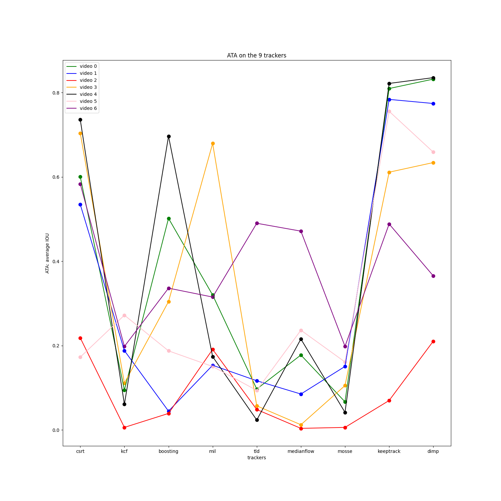
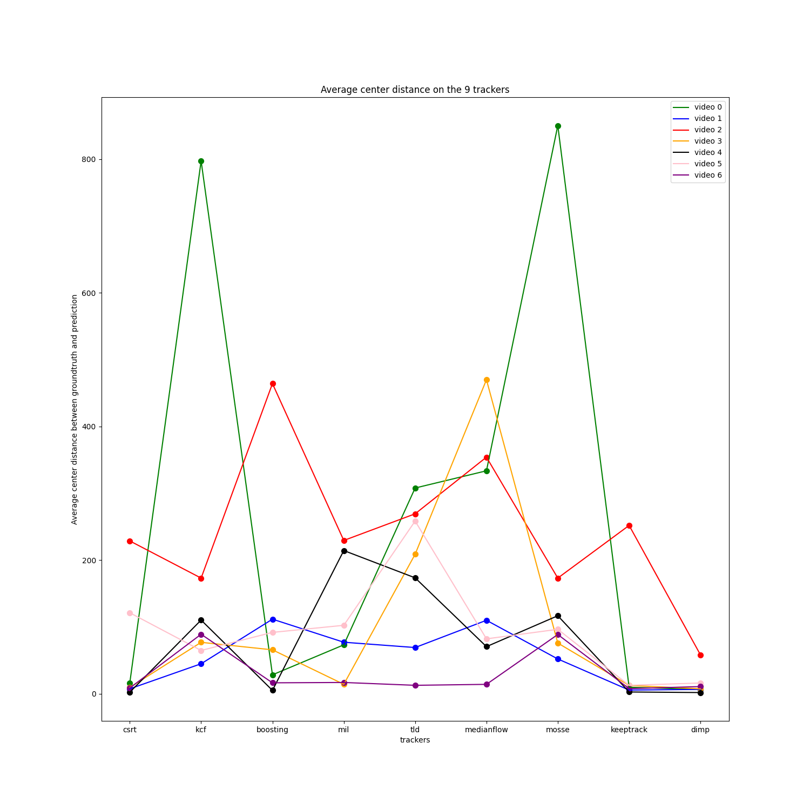

# Video Tracking with Single Object Tracking

### Architecture of the files

**launchvideo.ipynb** is for applying the bounding box to get some visualisation

**experiments.ipynb** is for getting the graphs and tables

In the **video** folder, videos are numbered from 0 to 9, total of 10 videos.

In the **img** folder, each sub folder are numbered from 0 to 9 and contain the images/frames of the associated video.

In the **groundtruth folder** each file is numbered from 0 to 9 and is associated with the videos and are the groundtruth.

In the **trackersresults** folder,  each sub folder are numbered from 0 to 9 and contain the results of the 10 trackers on that video.

# COMMANDS

To launch a video number + tracker to visualize the video
``` python visuaize.py -n 0 -t keeptrack ```

To launch the evaluation on a tracker
``` python evaluation.py -at -an -iou ```

To compute the txt outputfile of all the trackers on one video
``` python POCvideo.py -v video/0.mp4 -a -s -b ```


# KeepTrack and Dimp

Dimp
[[Paper]](https://arxiv.org/pdf/1904.07220)

KeepTrack
[[Paper]](https://arxiv.org/abs/2103.16556)

# Results

**Metrics - ATA** : Average of intersection over union for each frame on all videos and all trackers


|   video name |     csrt |        kcf |   boosting |      mil |       tld |   medianflow |      mosse |   keeptrack |     dimp |
|-------------:|---------:|-----------:|-----------:|---------:|----------:|-------------:|-----------:|------------:|---------:|
|            0 | 0.600265 | 0.0947224  |  0.501775  | 0.319953 | 0.0970563 |   0.177751   | 0.0668053  |   0.80947   | 0.831791 |
|            1 | 0.53456  | 0.188205   |  0.0446995 | 0.153463 | 0.116721  |   0.0852576  | 0.150708   |   0.783742  | 0.774023 |
|            2 | 0.21831  | 0.00616114 |  0.0392844 | 0.191123 | 0.0484802 |   0.00388831 | 0.00616114 |   0.0699199 | 0.210532 |
|            3 | 0.70357  | 0.111167   |  0.304375  | 0.679352 | 0.0572431 |   0.0124535  | 0.105341   |   0.611151  | 0.633959 |
|            4 | 0.735539 | 0.0609803  |  0.696411  | 0.173931 | 0.0237027 |   0.215694   | 0.0417914  |   0.821551  | 0.835253 |
|            5 | 0.172848 | 0.272213   |  0.187599  | 0.150574 | 0.0938571 |   0.236606   | 0.161179   |   0.755518  | 0.658759 |
|            6 | 0.583207 | 0.198029   |  0.336263  | 0.315155 | 0.49007   |   0.471421   | 0.198382   |   0.488448  | 0.365435 |



**Metrics - Center Distance** Average of the center distance on all videos and all trackers


|   video name |      csrt |      kcf |   boosting |      mil |      tld |   medianflow |    mosse |   keeptrack |     dimp |
|-------------:|----------:|---------:|-----------:|---------:|---------:|-------------:|---------:|------------:|---------:|
|            0 |  16.286   | 797.126  |   28.4322  |  73.265  | 307.868  |     333.619  | 850.096  |     9.79737 |  6.7381  |
|            1 |   7.50357 |  44.9639 |  111.681   |  77.1734 |  69.2395 |     110.008  |  52.1347 |     5.60393 |  6.619   |
|            2 | 228.721   | 173.129  |  464.056   | 229.422  | 269.279  |     354.056  | 173.129  |   251.904   | 58.2766  |
|            3 |   9.52687 |  77.0354 |   65.8253  |  14.2312 | 208.783  |     469.869  |  75.9511 |    12.6133  |  7.48011 |
|            4 |   2.38856 | 110.344  |    5.15526 | 214.341  | 173.52   |      70.5778 | 116.79   |     2.78491 |  1.90071 |
|            5 | 121.233   |  64.8511 |   91.8947  | 102.495  | 258.432  |      82.2269 |  96.515  |    12.7127  | 16.209   |
|            6 |   8.7232  |  89.1187 |   16.4671  |  16.9728 |  12.7297 |      14.167  |  88.7272 |     7.77926 | 10.8431  |




